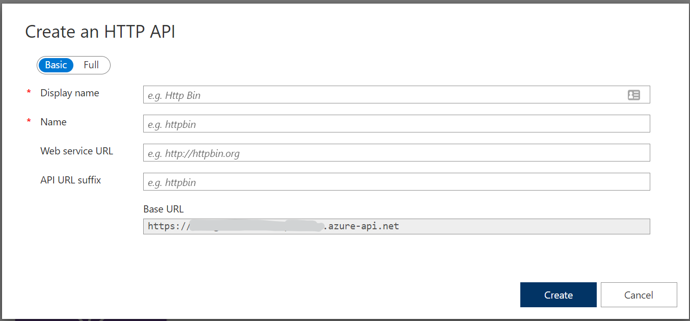
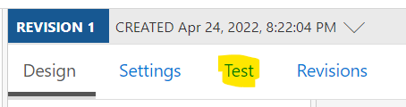

# Lab 1 Creating your first API

In this lab you will create a call to another API to realtime info about SL traffic.

In the lab you will use a key to authenticate towards the backend service. This key will not be usable after the session. If you want to try this, simply get your own by signing up for one at [https://www.trafiklab.se/](https://www.trafiklab.se/).

## The Steps

- [Lab 1 Creating your first API](#lab-1-creating-your-first-api)
	- [The Steps](#the-steps)
	- [Create a new API](#create-a-new-api)
	- [Update the policy](#update-the-policy)
	- [Test the API](#test-the-api)

## Create a new API

- Navigate to the [Azure Portal](https://portal.azure.com).
- Find your API management instance by typing its name in the search bar at the top of the page.
- Click the instance to navigate to the APIm start page.
- In the menu on the left side, find `APIs` and click it.
- Create a new API by finding the `+ Add API` option at the top if the API list.
- Choose the first option `Manually define an HTTP API`. This dialog appears:



- Enter the following values:
  - Display name: `SL Real time`
  - API URL suffix: `realtime`
- Click Create
- Find and click `+ Add operation` in the middle of the screen
- Enter the following values:
  - Display name: `departures`
  - URL: `GET` and `departures`
- A bit lower down on the page, find and locate the `Query` tab and click it.
- Under the query tab click `+ Add parameter` and enter the following values:
  - Name: `siteid`
  - Description: The ID of the stop
  - Type: string
- Click Save to create the operation

## Update the policy

You will now update the policy to add the API-key before calling the backend, SL Realtime service.

- In the overview page, find the Inbound processing header and click the `</>` symbol. This will open up the policy editor.
- Replace all the text in the policy editor with this text:

```XML
<policies>
	<inbound>
		<base />
		<set-query-parameter name="key" exists-action="override">
			<value>08575f86f8d041b78401d0e4abd6c95c</value>
		</set-query-parameter>
        <rewrite-uri template="/" copy-unmatched-params="true" />
		<set-backend-service base-url="https://api.sl.se/api2/realtimedeparturesV4.json" />
	</inbound>
	<backend>
		<base />
	</backend>
	<outbound>
		<base />
	</outbound>
	<on-error>
		<base />
	</on-error>
</policies>
```

- Click Save

The policy will add a query parameter called `key` and assign the given value, then remove the `departures` path from the URL. Lastly it points the call to the SL Realtime info API.

## Test the API

The best way of testing the API is to use the APIm portal itself. 

- In the portal locate the Test tab. Towards the to of the central blade.



- Click the link to view the test page.
- In the value for siteid, enter 9192 (Slussen).
- Then scroll down to the Test button and click it.
- If everything works, you will get back a json payload with information about departures from Slussen.
- Try other values as siteid. 9180 (Farsta strand) 9543 (Södertälje syd)