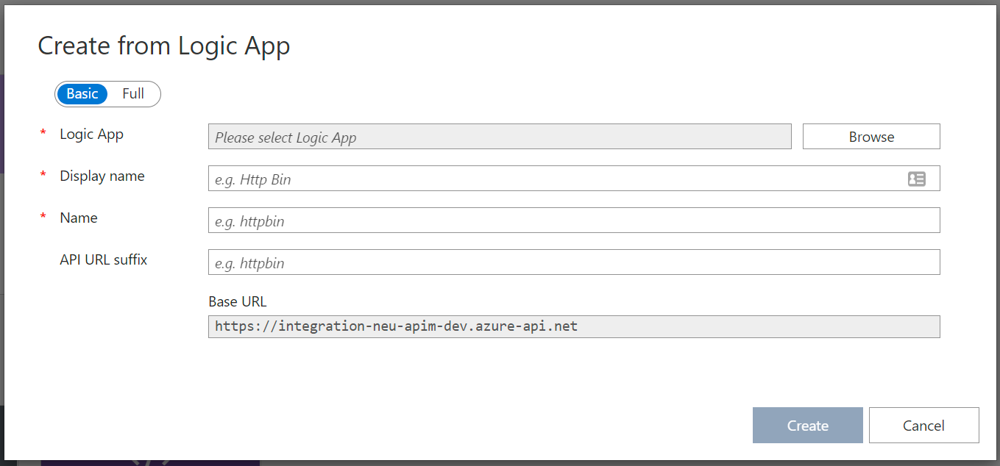
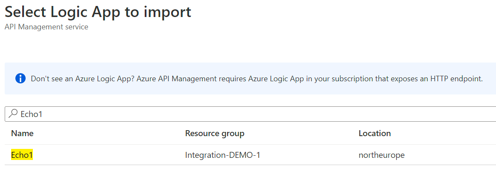
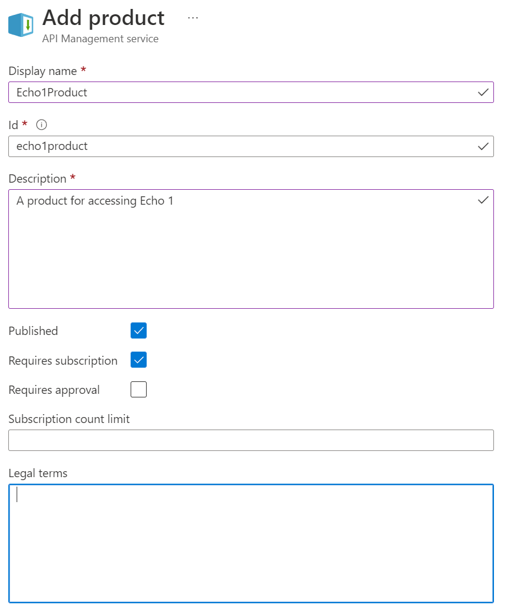
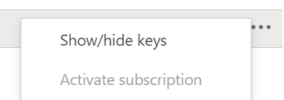
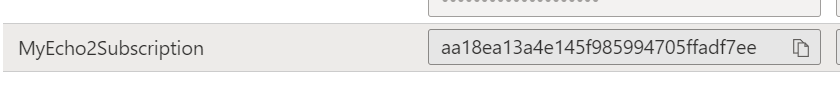

# Lab 2 Calling alternating backends

In order to illustrate the usage of different Products and Subscriptions we will create two backend Logic Apps, Echo 1 and Echo 2.

Each Logic App will be called by its own API, which in turn will be in its own subscripton. Only a subscription to the matching product will be allowed.

## Postman

In order to facilitate calls to your APIs, using [Postman](https://www.postman.com/downloads/) is recommended.

## The steps

The lab will have the following steps:

1. Create both backend [Logic Apps](#create-the-logic-apps)
2. Create an API that [calls the first Logic App](#create-the-first-api)
3. Create an API that [calls the other Logic App](#create-the-second-api)
4. [Create products](#create-the-products) and [add the APIs](#add-the-api-to-the-product).
5. [Create a subscription](#create-a-subscription) to one product.
6. [Test](#test-the-apis) which API you can access.

## Create the Logic Apps

This will take you to your Azure and ask for some input. It will then create two Logic Apps in the same resource group.

> Make sure you create the Logic Apps in the same subscription as your API management instance.

[](https://portal.azure.com/#create/Microsoft.Template/uri/https%3A%2F%2Fraw.githubusercontent.com%2Fmikaelsand%2Freactor-sthlm-apim%2Fmain%2FSession2%2FLab2%2FLogicApps-template.json)

## Create the first API

Open your API manager in the Azure portal. And find `APIs` in the menu to the left. Click it and look in the panel to the right.

You will see three different categories for creating an API. `Define a new API`, `Create from Defintion` and `Create from Azure resource`, in the last one, find and click Logic App. You will be greeted with this window:



You will need to update the values to use your Logic App.

- Click `Browse` to open a dialog to find a Logic App.
- You can use the Search window to find your Logic App.

When you have found the Logic App called Echo1, select it and the click the Select button at the bottom of the page.
- Update the field `API URL Suffix` to say `echo1` and click create

Your API will now be created and connected to the Logic App automatically, including a secured connection.

### Testing your first API

When the API has been created, it will contain one operation called request-invoke. You can test this using the testing feature in the Portal. Simply select the Test tab and the click Send at the bottom of the page.

You should receive a `200 OK` back as well as a response body like this:

```JSON
{
    "Echo": "Hello from 1"
}
```

## Create the second API

This is just a repeat of every step above but make sure you select the Echo2 Logic App and name the API Echo2.

## Create the products

Products are what a subscription is connected to. You *subscribe* to a *product*. You need to create products for your callers to access Echo 1 and Echo 2. However, we need to make sure that a subscription only has access to Echo 1 for now.

- In the API management portal, in the left menu, find and select `Products`.
- On the top of the next page, find Add and click it.
- In the new window fill in according to the image.

**Make sure you select Published**
- Click Create at the bottom of the page

## Add the API to the product

- On the product list page, select your new product `EchoProduct1`
- In the menu to the left, select `APIs`.
- Select Add at the top of the page.
- You can search for your API using the search box.
- When you have found your `Echo1` API, tick the box and click Select at the buttom of the page.
- Do not leave the page.

You have now created a `Product` that contains one `API`. 

## Create a subscription

On the same page, you can create a new subscription to your new product.

- In the menu to the left, find and select `Subscriptions`.
- At the top of the page Select `Add Subscription`.
- In the flyout window to the right, type `MyEcho1Subscription` for both `Name` and `Display name`
- Click Create at the bottom right to create the subscription.
- The subscription will now be added to the list.

## Test the APIs

In order to test the subscription you need to call the API using the new subcription using its subscription key.

### Finding your subscription key

In order to test the API you need to supply an API-key.

- In the menu to the left find and select `Subscriptions`
- Find `MyEcho1Subscription`.
- All the way to the right you will see three dots. Click the dots on the `MyEcho1Subscription` line.
- Select Show/Hide keys at the top.

- This will make the subcription keys visible.
- Copy one of your `MyEcho1Subscription` subscription keys for use in the API calls.


Using which ever tool you want to call the API, issue a call like this.

```http
GET https://{{YourAPImInstanceName}}.azure-api.net/echo1/request/paths/invoke HTTP/1.1
Host: {{YourAPImInstanceName}}.azure-api.net
Content-Type: application/json
Ocp-Apim-Subscription-Key: {{MyEcho2SubscriptionKey}}

{}
```

If you are using Postman, you can use [this collection](Session%202.postman_collection.json). Just make sure to update the Collection variables to reflect your environment.

### Test Echo 2 for access

If you update your URL to point to the Echo 2 api, and still use the same subscription key, you will get back a `401 Access Denied` as the `subscription` is connected to a `product` that containts only the Echo 1 `API`.